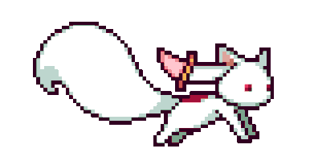

  
<pre>
    💼 Full-Stack Software Engineer • Builder
    💻 Modern Web & APIs • Agentic AI • DevOps
    📖 Clean Architecture • Domain-Driven Design & SOLID
    🎮 Music • Games • Anime
    ✨ Always learning, creating, and exploring new idea
</pre>
 

  

